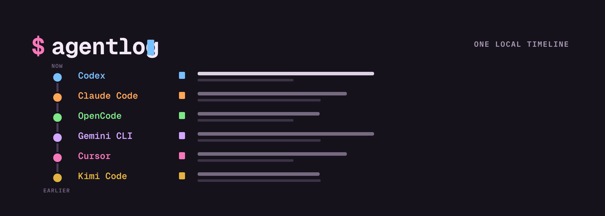

# Agentlog

> All your AI coding-agent sessions in one local timeline.

Agentlog gives developers who use multiple AI coding agents one place to find
and revisit their sessions. It reads supported agents' local history without
changing the original files, then builds a local SQLite catalog for fast
browsing.



## Why Agentlog?

- **One timeline for every supported agent.** Browse sessions from supported
  coding agents in a shared chronological view.
- **Find the session you remember.** Filter by provider, repository, working
  directory, model, execution kind, or start date, then preview the cataloged
  transcript without leaving the terminal.
- **Keep source history local and unchanged.** Agentlog reads provider data,
  writes only to its own local catalog, and does not send catalog data over the
  network. The last successful catalog snapshot remains available with a
  diagnostic.

## Get started

The shortest setup requires macOS and [Homebrew](https://brew.sh/). Nix and
prebuilt release archives also support macOS and Linux; see
[Other installation options](#other-installation-options).

1. Install Agentlog:

   ```sh
   brew install choplin/tap/agentlog
   ```

2. Build the local catalog from supported histories already on your machine:

   ```sh
   agentlog sync
   ```

   The command reports source outcomes and the number of sessions available in
   the catalog. A provider or source failure does not stop the other sources.

3. Open the catalog:

   ```sh
   agentlog browse
   ```

   The browser shows a chronological list when the catalog contains sessions,
   or an empty state when it does not. Wide terminals also show a preview pane;
   on narrower terminals, press `Enter` to open the selected session. Use the
   arrow keys or `j`/`k` to move, `f` to filter, `?` for the key reference, and
   `q` to quit.

## Other installation options

Agentlog supports Apple Silicon and Intel macOS, plus ARM64 and x86-64 Linux.
Review the current [limitations](#limitations) before choosing an installation.

### Nix

Run Agentlog without installing it:

```sh
nix run github:choplin/agentlog -- sync
nix run github:choplin/agentlog -- browse
```

Or install the default flake package into your profile:

```sh
nix profile install github:choplin/agentlog
agentlog --version
```

The flake exposes a default package and app for `aarch64-darwin`,
`x86_64-darwin`, `aarch64-linux`, and `x86_64-linux`. Linux packages use a
static musl build.

### GitHub Releases

Download the archive and matching `.sha256` file for your system from the
[latest release](https://github.com/choplin/agentlog/releases/latest):

| System | Archive |
| --- | --- |
| Apple Silicon macOS | `agentlog-aarch64-apple-darwin.tar.xz` |
| Intel macOS | `agentlog-x86_64-apple-darwin.tar.xz` |
| ARM64 Linux | `agentlog-aarch64-unknown-linux-musl.tar.xz` |
| x86-64 Linux | `agentlog-x86_64-unknown-linux-musl.tar.xz` |

Verify the archive with `shasum -a 256 -c <archive>.sha256` on macOS or
`sha256sum -c <archive>.sha256` on Linux. Then extract it and install the
binary somewhere on `PATH`; for example:

```sh
archive=agentlog-aarch64-apple-darwin.tar.xz
tar -xJf "$archive"
mkdir -p "$HOME/.local/bin"
install -m 0755 "${archive%.tar.xz}/agentlog" "$HOME/.local/bin/agentlog"
agentlog --version
```

Replace `archive` with the filename for your system. Add `$HOME/.local/bin` to
`PATH` if necessary.

## Explore your catalog

The browser keeps the current catalog available while a read-only sync runs in
the background. It preserves your selection when refreshed sessions are
replaced and reports whether sources were refreshed, partial, failed, or
missing.

- Press `f` to filter by provider, repository, working directory, model,
  execution kind, or start date.
- Group matching sessions by provider or repository.
- Press `!` to inspect retained source diagnostics.
- Press `r` to request another background sync.

The same catalog is available through non-interactive commands:

| Command | Purpose |
| --- | --- |
| `agentlog sync` | Refresh the catalog from supported local histories. |
| `agentlog browse` | Browse and filter sessions interactively. |
| `agentlog list` | List cataloged sessions without synchronizing. |
| `agentlog show <session-id>` | Print one cataloged session. |
| `agentlog paths` | Show Agentlog-owned paths and provider-source boundaries. |
| `agentlog purge` | Preview and confirm removal of catalog rows. |

Commands with structured output support `--json` where shown by
`agentlog <command> --help`.

## Supported provider history

Agentlog imports local history from the providers shown in the opening flow.
The [provider reference](docs/providers.md) documents source formats, discovery
precedence, configuration overrides, projection rules, failure handling, and
safety bounds.

## Data stays local

Agentlog separates provider-owned source data from its derived catalog.
Provider sources are read only. The catalog stores normalized session metadata
and visible transcript content for browsing while excluding provider
thinking/reasoning and tool payloads. The current runtime reads and writes only
local data.

Agentlog stores its optional `config.toml` and `agentlog.sqlite3` catalog under
the platform data directory. Run `agentlog paths` to see the resolved paths and
provider-source boundaries.

`agentlog purge` removes rows from the Agentlog-owned catalog after preview and
confirmation. It leaves provider logs, configuration, database files, and the
database schema unchanged. See [Data architecture](docs/data-architecture.md)
for the complete data flow, stored and excluded fields, retention behavior,
local-only boundary, and purge safety checks.

## Limitations

- Agentlog is a local, single-user browser; it does not synchronize data to a
  hosted service.
- Windows is not supported.
- Release binaries are not code-signed or notarized.
- Sources may be partial, malformed, unsupported, oversized, unreadable, or
  changed during collection. Agentlog reports their state and preserves the
  last successful data when available.
- Imported content includes the visible fields supported by each provider, not
  every field in the native format.

## License

Agentlog is available under the [MIT License](LICENSE).
